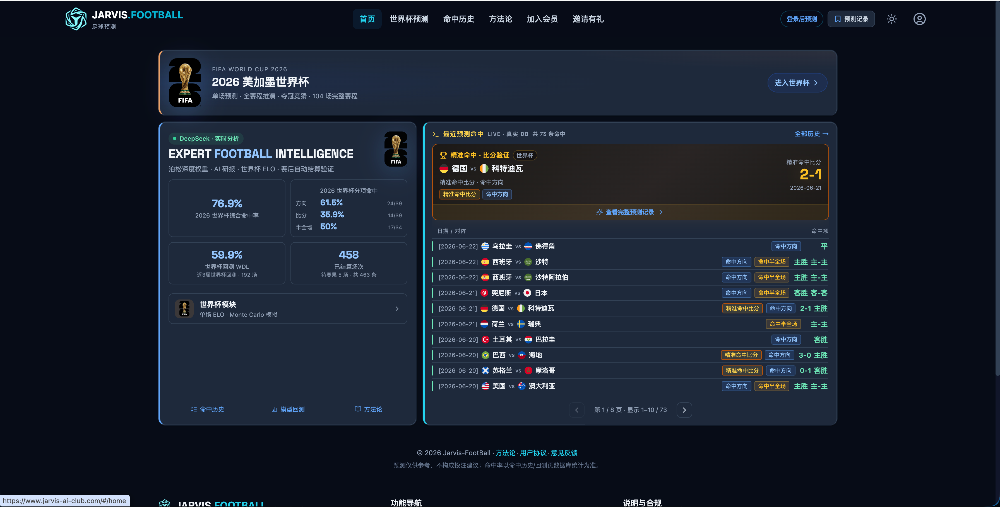

<div align="center">

# ⚽ Jarvis-FootBall V2.0

**足球 AI 预测 · 足球比赛预测 · 第二代五维智能分析平台**

> Football Prediction · Soccer AI Analytics · DeepSeek LLM · ELO + Poisson · 竞彩体彩

[🌐 在线体验](https://www.jarvis-ai-club.com) · [📊 公开战绩](https://www.jarvis-ai-club.com/#/performance) · [🎯 方案大厅](https://www.jarvis-ai-club.com/#/plan-hall-v2) · [📐 方法论](https://www.jarvis-ai-club.com/#/methodology) · [👑 加入会员](https://www.jarvis-ai-club.com/#/membership) · [📄 GitHub Pages](https://jiatonglingit.github.io/jarvis-footBall/)

[](https://www.jarvis-ai-club.com)
[](https://python.org)
[](docs/METHODOLOGY.md)
[](docs/METHODOLOGY.md)
[](https://www.jarvis-ai-club.com)
[](LICENSE)

</div>

---

## 🔍 你在找什么？

| 搜索关键词 | 本项目提供 |
|-----------|-----------|
| **足球预测** / **足球比赛预测** | 每日竞彩场次全覆盖，胜平负 · 让球 · 进球 · 比分 · 半全场 |
| **足球 AI 预测** / **足球预测软件** | 第二代五维模型 + DeepSeek 深度研报 + 把握分级 |
| **足球预测 GitHub** / **足球预测模型** | 开源 Poisson + ELO Demo，方法论完全公开可复现 |
| **2026 世界杯预测** | 104 场赛程 · Monte Carlo 冠军模拟 · 专项分析 |

---

## 📌 项目简介

**Jarvis-FootBall V2.0（第二代足球预测模型）** 是一个数据驱动的 **足球 AI 预测平台**，面向 **竞彩体彩** 与 **2026 美加墨世界杯**，通过统计模型 + 大模型协同生成赛事分析：

1. **五维智能分析**：胜平负、让球、进球数、比分、半全场，配合把握分级与「观望」标签
2. **ELO 评分体系**：基于国家队 / 俱乐部 ELO，对数模型换算胜平负概率
3. **Poisson 深度权重**：ELO 差推导预期进球 λ，输出完整比分概率矩阵
4. **Monte Carlo 模拟**：世界杯 104 场 + 淘汰赛树，模拟冠军概率与晋级路径
5. **DeepSeek AI 研报**：在数学基线之上注入结构化数据，生成自然语言深度分析（AI 不改变底层概率）
6. **公开战绩结算**：预测 vs 真实比分逐场对比，命中记录公开可查、可审计

> ⚠️ **声明**：本项目仅供学术研究与技术展示，**不构成任何形式的投注建议**。请理性看球，遵守当地法律法规。

---

## ✨ V2.0 核心功能

| 功能模块 | 描述 |
|---------|------|
| 🏟️ **赛事广场** | 每日竞彩全覆盖 · 五维推荐 · 把握大/中/小 · 观望标签 · 首发锁定 |
| 🎯 **AI 方案大厅** | 官方精选方案 · 单场/串关/过关 · 奖金预估 · 一键截图分享 |
| 🤖 **DeepSeek 深度研报** | 结构化 Prompt 注入 ELO / λ / 隐含概率，禁止 LLM 虚构战绩 |
| 📊 **公开战绩中心** | 预测 vs 真实比分逐场可查，按日期 / 玩法 / 联赛浏览 |
| 📐 **透明方法论** | ELO + Poisson + Monte Carlo 公式完全公开，可复现 |
| 📈 **策略回测** | 凯利 / 半凯利 / 固定投注 / 马丁等资金管理模拟 |
| 🏆 **2026 世界杯模块** | 104 场完整赛程 · 单关预测 · 全赛事 Monte Carlo · 冠军竞猜 |
| 👤 **会员与邀请体系** | 注册即送积分 · 会员无限预测 · 邀请有礼 |

---

## 🆕 第一代 → 第二代升级

| 维度 | V1（第一代） | V2（第二代） |
|------|-------------|-------------|
| 定位 | 2026 世界杯专项 | **竞彩日常 + 世界杯** 双主线 |
| 预测维度 | 胜平负 / 比分 / 半全场 | **五维**：+ 让球 + 进球数 |
| 产品形态 | 预测列表 | **赛事广场 + 方案大厅 + 策略回测** |
| 风险控制 | 基础置信度 | **把握分级 + 观望标签 + 首发锁定** |
| AI 研报 | DeepSeek 单场分析 | 结构化注入 + 方案级组合分析 |

---

## 🖥️ 界面预览

### V2.0 · 赛事广场 & 方案大厅


> 完整体验请访问 **[www.jarvis-ai-club.com](https://www.jarvis-ai-club.com)**

<details>
<summary>V1.0 世界杯模块预览（点击展开）</summary>



</details>

---

## 📈 预测表现（公开可查）

> 以下数据来自官网公开战绩页，赛后自动结算，非手写数字。  
> 查看完整记录：[公开战绩 →](https://www.jarvis-ai-club.com/#/performance)

| 指标 | 数值 | 说明 |
|------|------|------|
| **综合命中率** | **76.9%** | 方向 / 比分 / 半全场综合（世界杯样本） |
| 方向命中 | 61.5% | 胜平负预测 |
| 比分命中 | 35.9% | 精确比分 |
| 半全场命中 | 50.0% | 半场 + 全场组合 |
| 世界杯回测 WDL | 59.9% | 近 3 届世界杯 192 场回测 |
| 已结算场次 | 458+ | 持续更新中 |

### 近期命中示例

| 日期 | 对阵 | 预测 | 实际 | 命中 |
|------|------|------|------|------|
| 2026-06-21 | 德国 vs 科特迪瓦 | 主胜 · 2-1 | 2-1 | ✅ 方向 + 比分 |
| 2026-06-21 | 乌拉圭 vs 摩洛哥 | 客胜 | 0-1 | ✅ 方向 |
| 2026-06-21 | 西班牙 vs 沙特 | 主胜 | 2-0 | ✅ 方向 |
| 2026-06-20 | 法国 vs 塞内加尔 | 主胜 | 3-1 | ✅ 方向 |
| 2026-06-20 | 巴西 vs 哥斯达黎加 | 主胜 | 2-0 | ✅ 方向 |

---

## 🧠 技术架构

```
用户请求
   │
   ├─► ELO 评分层 ──► 胜平负概率（对数 ELO 模型）
   │
   ├─► Poisson 引擎 ──► λ_home / λ_away ──► 比分矩阵 ──► TOP 比分
   │
   ├─► Monte Carlo ──► 104 场 WC 模拟 ──► 冠军 / 晋级概率
   │
   └─► DeepSeek LLM ──► 结构化 Prompt ──► 深度研报（只解读，不改概率）
```

**核心技术栈：**

- **统计模型**：Poisson 分布 · ELO Rating · Monte Carlo Simulation
- **AI 分析**：DeepSeek 大语言模型（结构化 Prompt，禁止虚构）
- **前端**：React + TypeScript（官网 V2.0）
- **数据**：MongoDB · 竞彩 HAD 同步 · eloratings.net ELO

详细公式见 [docs/METHODOLOGY.md](docs/METHODOLOGY.md)

---

## 🚀 快速体验

### 在线使用（推荐）

直接访问 **[https://www.jarvis-ai-club.com](https://www.jarvis-ai-club.com)** 获取完整 V2.0 功能：

- 赛事广场五维预测
- AI 方案大厅
- DeepSeek 深度研报
- 公开战绩逐场验证
- 会员无限预测

### 本地 Demo（教育用途）

本仓库包含一个**独立的 Poisson + ELO 演示脚本**，展示核心数学模型，**不包含生产环境 API 与数据库**。

```bash
# 1. 克隆仓库
git clone https://github.com/jiatonglingit/jarvis-footBall.git
cd jarvis-footBall

# 2. 创建虚拟环境
python -m venv venv
source venv/bin/activate        # Windows: venv\Scripts\activate

# 3. 安装依赖
pip install -r requirements.txt

# 4. 运行演示
python demo/predict.py

# 5. 指定比赛（可选）
python demo/predict.py --home "Germany" --away "Ivory Coast" --home-elo 2040 --away-elo 1830
```

**Demo 输出示例：**

```
==================================================
  Jarvis-FootBall · Poisson + ELO Demo
  完整功能 → https://www.jarvis-ai-club.com
==================================================

比赛: Germany vs Ivory Coast
ELO:  2040 vs 1830  (差 +210)

预期进球: 主 1.68 · 客 0.92

胜平负概率:
  主胜  58.2%  ████████████
  平局  22.4%  ████
  客胜  19.4%  ███

TOP 5 比分:
  1. 2-1  12.3%
  2. 1-0  11.8%
  3. 2-0  10.6%
  ...

→ 访问官网获取 DeepSeek 深度研报与完整预测
```

---

## 📁 项目结构

```
jarvis-footBall/
├── README.md              # 本文件（推广主页 · SEO 入口）
├── demo/
│   ├── predict.py         # Poisson + ELO 演示脚本
│   └── data/
│       └── sample_teams.json
├── docs/
│   ├── METHODOLOGY.md     # 公开方法论
│   ├── QUICKSTART.md      # 快速开始
│   └── index.html         # GitHub Pages 跳转页
├── static/
│   ├── preview-v2.png     # V2.0 界面截图
│   ├── preview-v1.png     # V1 世界杯截图
│   └── preview.png        # 主预览图（V2）
├── requirements.txt
└── LICENSE
```

> 💡 本仓库为**展示与教育用途**。完整产品（会员体系、AI 研报、实时结算）仅在 [官网](https://www.jarvis-ai-club.com) 提供。

---

## 🗺️ 路线图

- [x] 2026 世界杯 104 场赛程接入
- [x] ELO + Poisson + Monte Carlo 核心引擎
- [x] DeepSeek AI 深度研报
- [x] 命中历史自动结算与公开展示
- [x] 五大联赛 Poisson 深度权重
- [x] **V2.0 五维预测 + 赛事广场 + 方案大厅**
- [x] **策略回测 + 把握分级 + 观望标签**
- [ ] 更多联赛扩展（欧冠、亚冠）
- [ ] 球员伤病 / 天气因子接入
- [ ] 移动端 App

---

## ⚠️ 免责声明

1. 预测结果仅供参考，**不构成投注建议**
2. 历史命中率不代表未来表现
3. 足球比赛受多种不可预测因素影响
4. 请遵守当地法律法规，理性看球
5. 请勿将本平台用于任何违法活动

---

## 📬 联系与反馈

- 🌐 官网：[https://www.jarvis-ai-club.com](https://www.jarvis-ai-club.com)
- 💬 反馈：[官网反馈入口](https://www.jarvis-ai-club.com/#/feedback)
- 🐛 Issue：欢迎在本仓库提交功能建议（非源码请求）

---

<div align="center">

**Jarvis-FootBall V2.0** · 足球 AI 预测 · 数据驱动，透明可验证

[立即体验 →](https://www.jarvis-ai-club.com)

</div>
